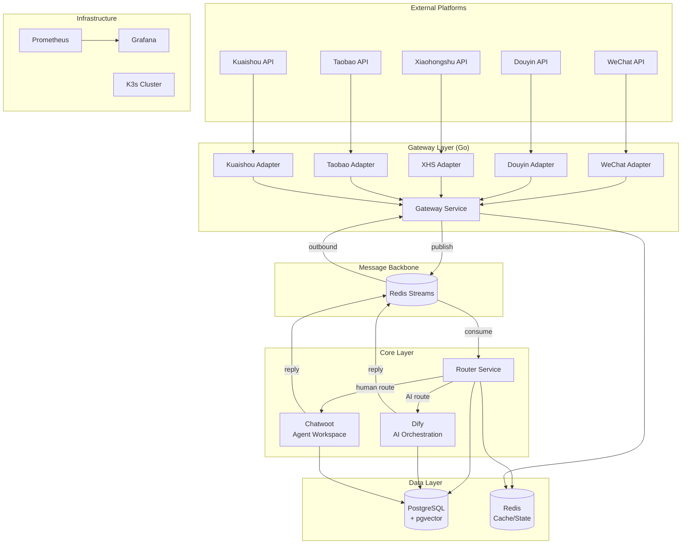

# UNICA - System Architecture Document

**Project:** UNICA (Unified Intelligent Customer Assistant)
**Version:** 1.0
**Date:** 2026-03-04
**Author:** System Architect (BMAD)
**Status:** Approved
**PRD:** [docs/prd-unica-2026-03-04.md](prd-unica-2026-03-04.md)

---

## 1. Architectural Drivers

The following NFRs have the highest impact on architecture design:

| Driver | NFR | Impact | Design Response |
|--------|-----|--------|----------------|
| Performance | NFR-001 | Gateway <100ms, AI <3s, 100-1000 QPS | Async message processing via Redis Streams, connection pooling |
| Availability | NFR-002 | 99.9% uptime, channel fault isolation | Per-channel adapter isolation, circuit breakers, K3s rolling deploy |
| Scalability | NFR-004 | New channels without affecting existing | Adapter plugin pattern, stateless gateway, horizontal pod scaling |
| Security | NFR-003 | Private deployment, data encryption | Self-hosted everything, TLS everywhere, PII encryption at DB level |

---

## 2. High-Level Architecture

### 2.1 Pattern: Event-Driven Microservices

The system uses an **event-driven microservices** architecture with Redis Streams as the message backbone. Each layer is independently deployable and scalable.

**Rationale:**
- Platform webhooks require fast acknowledgment (<5s) while AI inference takes ~3s → async decoupling is essential
- Per-channel fault isolation is a core requirement → independent adapter services
- 7-8 product lines need independent scaling → stateless services + queue-based load leveling

### 2.2 Architecture Diagram



### 2.3 Message Flow

```
INBOUND (Customer → System):
  Platform Webhook
    → Channel Adapter (verify signature, decrypt)
    → Gateway Service (normalize to standard JSON, dedup)
    → Redis Streams [inbound queue]
    → Router Service (identify product line, check state)
    → Dify (AI response) OR Chatwoot (human queue)

OUTBOUND (System → Customer):
  AI/Human Reply
    → Redis Streams [outbound queue]
    → Gateway Service (convert to platform format)
    → Channel Adapter (encrypt, sign)
    → Platform API (send message)

HANDOFF (AI → Human):
  AI confidence < threshold
    → Router Service publishes handoff event
    → Chatwoot receives conversation with full context
    → Human agent picks up in unified inbox
```

---

## 3. Technology Stack

### 3.1 Gateway Layer

| Component | Technology | Rationale |
|-----------|-----------|-----------|
| Gateway Service | **Go 1.22+** | High concurrency (goroutines), low latency, mature HTTP/crypto libraries |
| Channel Adapters | **Go (per-adapter module)** | Same language as gateway, each adapter is a separate Go package, independently testable |
| Message Format | **Standard JSON Schema** | Universal, human-readable, supported by all downstream services |

**Trade-offs:** Go over Rust — slightly less raw performance but significantly faster development, easier team onboarding, richer ecosystem for API integration.

### 3.2 Message Backbone

| Component | Technology | Rationale |
|-----------|-----------|-----------|
| Message Queue | **Redis Streams** | Already in stack (Redis), persistent queues with consumer groups, sufficient for 1000 QPS, no new infra needed |
| Event Format | **CloudEvents-compatible JSON** | Standard envelope with type/source/subject, easy to route and trace |

**Trade-offs:** Redis Streams over NATS/RabbitMQ — avoids adding new infrastructure component. If throughput exceeds 10K QPS in future, can migrate to NATS JetStream.

### 3.3 Core Layer

| Component | Technology | Rationale |
|-----------|-----------|-----------|
| Router Service | **Go** | Stateless routing logic, reads config from Redis/PG, publishes events |
| Agent Workspace | **Chatwoot (self-hosted)** | Mature multi-channel inbox, RBAC, reporting, REST/WebSocket API, reduces frontend dev effort |
| AI Orchestration | **Dify (self-hosted)** | Multi-agent + RAG + prompt management, per-workspace isolation maps to product lines |

**Trade-offs:** Chatwoot/Dify are external open-source projects — limited deep customization, but API-first integration avoids source code forking. If customization limits are hit, specific modules can be replaced incrementally.

### 3.4 Data Layer

| Component | Technology | Rationale |
|-----------|-----------|-----------|
| Primary Database | **PostgreSQL 16 + pgvector** | Unified relational + vector storage, proven at scale, reduces operational complexity |
| Cache / State | **Redis 7** | Token cache, session state, rate limiting, message queue (Streams), pub/sub |
| Knowledge Vectors | **pgvector** (via Dify) | Integrated with PostgreSQL, no separate vector DB needed for current scale |

### 3.5 Infrastructure

| Component | Technology | Rationale |
|-----------|-----------|-----------|
| Container Orchestration | **K3s** | Lightweight Kubernetes, multi-node, suitable for private deployment |
| Monitoring | **Prometheus + Grafana** | K3s native integration, industry standard, self-hosted |
| Logging | **Loki + Grafana** | Pairs with Prometheus/Grafana stack, lightweight log aggregation |
| CI/CD | **TBD** (GitLab CI or GitHub Actions) | To be decided during implementation phase |
| Container Registry | **Harbor** (self-hosted) | Private registry for private deployment requirement |

---

## 4. System Components

### 4.1 Channel Adapter (per platform)

**Purpose:** Protocol translation between platform API and gateway standard format.

**Responsibilities:**
- Receive platform webhook callbacks
- Verify signatures, decrypt messages per platform spec
- Convert platform-specific message types to standard JSON
- Convert outbound standard JSON to platform-specific format
- Send reply messages via platform API

**Interfaces:**
- HTTP webhook endpoint (inbound from platform)
- Internal gRPC/HTTP to Gateway Service

**Dependencies:** Redis (token cache), Platform API credentials

**FRs Addressed:** FR-001, FR-002

**Deployment:** Each adapter is an independent K3s Deployment. Can be scaled, updated, or restarted independently.

---

### 4.2 Gateway Service

**Purpose:** Central message processing hub — deduplication, normalization, rate limiting, outbound dispatch.

**Responsibilities:**
- Receive normalized messages from adapters
- Message deduplication (idempotency key in Redis)
- Rate limiting (per-channel, per-user)
- Publish inbound messages to Redis Streams
- Consume outbound messages from Redis Streams
- Dispatch replies to correct channel adapter
- Token lifecycle management

**Interfaces:**
- Internal HTTP API (from adapters)
- Redis Streams producer/consumer
- Redis (dedup cache, token store, rate limiter)

**Dependencies:** Redis, Channel Adapters

**FRs Addressed:** FR-002, FR-003, FR-004, FR-005

---

### 4.3 Router Service

**Purpose:** Conversation orchestration — route messages to AI or human, manage handoff, track conversation state.

**Responsibilities:**
- Identify product line from channel-account mapping
- Route new conversations to Dify AI Agent
- Monitor AI confidence scores, trigger handoff
- Manage conversation state machine (Pending → AI → Human → Closed)
- Generate intent summary for handoff context
- Agent distribution logic (product line + load balancing)

**Interfaces:**
- Redis Streams consumer (inbound messages)
- Redis Streams producer (outbound replies, handoff events)
- REST API to Dify (AI inference)
- REST/WebSocket API to Chatwoot (human routing)
- PostgreSQL (conversation state, routing config)

**Dependencies:** Redis Streams, Dify, Chatwoot, PostgreSQL

**FRs Addressed:** FR-006, FR-007, FR-008, FR-009, FR-010, FR-015

---

### 4.4 Dify (AI Orchestration)

**Purpose:** AI inference engine — RAG retrieval, LLM generation, multi-agent management.

**Responsibilities:**
- Host per-product-line AI Agents (isolated workspaces)
- RAG knowledge retrieval from pgvector
- LLM prompt execution with system/user context
- Confidence score calculation
- Knowledge base document management (upload, vectorize, delete)
- Proactive marketing intent detection

**Interfaces:**
- REST API (called by Router Service)
- Web UI (for knowledge admin, prompt tuning)
- PostgreSQL + pgvector (knowledge storage)

**Dependencies:** PostgreSQL (pgvector), LLM API endpoint

**FRs Addressed:** FR-011, FR-012, FR-013, FR-014, FR-015

---

### 4.5 Chatwoot (Agent Workspace)

**Purpose:** Human agent workspace — unified inbox, conversation management, team collaboration.

**Responsibilities:**
- Unified inbox for all channels (via custom channel API)
- Display AI conversation history and intent summary
- Quick reply templates management
- Customer profile sidebar
- Satisfaction survey dispatch
- Agent performance metrics
- RBAC permission enforcement

**Interfaces:**
- Web UI (for agents, supervisors)
- REST API (called by Router Service for message routing)
- WebSocket (real-time message updates)
- PostgreSQL (conversation storage, user data)

**Dependencies:** PostgreSQL, Redis (Chatwoot internal cache)

**FRs Addressed:** FR-016, FR-017, FR-018, FR-019, FR-020, FR-025

---

### 4.6 Report & Alert Service

**Purpose:** Data aggregation, dashboard generation, and alerting.

**Responsibilities:**
- Aggregate AI effectiveness metrics (resolution rate, handoff rate)
- Aggregate agent performance metrics
- Channel traffic analysis
- Alert rule evaluation and notification dispatch
- Export reports (CSV)

**Interfaces:**
- Grafana dashboards (visualization)
- Prometheus metrics endpoint
- Webhook notifications (DingTalk/WeCom/Feishu)
- PostgreSQL (read analytics data)

**Dependencies:** PostgreSQL, Prometheus, Grafana

**FRs Addressed:** FR-021, FR-022, FR-023, FR-024

---

### 4.7 Admin Service

**Purpose:** System configuration, channel management, AI agent settings, audit logging.

**Responsibilities:**
- Channel credential CRUD with encryption
- AI Agent configuration (prompt, threshold, rules)
- RBAC role and permission management
- Product-line data isolation enforcement
- Operation audit log recording

**Interfaces:**
- REST API (consumed by Chatwoot admin UI or standalone admin panel)
- PostgreSQL (config storage, audit logs)

**Dependencies:** PostgreSQL, Redis

**FRs Addressed:** FR-025, FR-026, FR-027, FR-028

---

## 5. Data Architecture

### 5.1 Core Data Entities

```
Channel (id, platform, name, credentials_encrypted, webhook_url, enabled, product_line_id)
  └── has many: Conversations

ProductLine (id, name, dify_agent_id, config_json)
  ├── has many: Channels
  ├── has many: KnowledgeDocs
  └── has many: Agents (human)

Conversation (id, channel_id, product_line_id, customer_id, state, ai_confidence, assigned_agent_id, created_at, closed_at)
  └── has many: Messages

Message (id, conversation_id, direction, sender_type, content_json, platform_msg_id, confidence_score, created_at)

Customer (id, platform_identity, channel_id, display_name, tags, notes, first_seen_at)
  └── has many: Conversations

Agent (id, name, email, role, product_line_ids[], max_concurrent, online_status)
  └── has many: Conversations (assigned)

KnowledgeDoc (id, product_line_id, filename, status, vector_count, uploaded_at)

AuditLog (id, actor_id, action, entity_type, entity_id, before_json, after_json, created_at)

AlertRule (id, metric, threshold, operator, notification_channel, enabled)
```

### 5.2 Database Design

```
PostgreSQL Databases:
  unica_core    — Channels, ProductLines, Conversations, Messages, Customers, Agents, AuditLogs, AlertRules
  chatwoot_db   — Chatwoot internal tables (managed by Chatwoot)
  dify_db       — Dify internal tables + pgvector knowledge (managed by Dify)

Key Indexes:
  conversations: (product_line_id, state), (customer_id), (assigned_agent_id, state)
  messages: (conversation_id, created_at), (platform_msg_id) UNIQUE
  customers: (platform_identity, channel_id) UNIQUE

Partitioning:
  messages: Range partition by created_at (monthly) — highest volume table
  audit_logs: Range partition by created_at (monthly) — retention policy via partition drop
```

### 5.3 Data Flow

```
Redis Data:
  - Token cache: channel:{channel_id}:token → {access_token, expires_at} (TTL-based)
  - Dedup cache: dedup:{platform_msg_id} → 1 (TTL 24h)
  - Rate limiter: rate:{channel_id}:{window} → counter (sliding window)
  - Session state: session:{conversation_id} → {state, product_line, agent_id} (hash)
  - Streams: inbound_messages, outbound_messages, handoff_events (consumer groups)

Data Isolation:
  - All queries on unica_core scoped by product_line_id
  - Chatwoot: uses "Account" concept per product line
  - Dify: uses "Workspace" concept per product line
  - Row-level security (RLS) on PostgreSQL for defense-in-depth
```

---

## 6. API Design

### 6.1 API Architecture

| Aspect | Decision |
|--------|----------|
| Style | REST (JSON) for all service-to-service communication |
| Auth (Internal) | Service-to-service: mTLS or shared secret in K3s internal network |
| Auth (External) | Chatwoot UI: JWT (Chatwoot native); Admin API: JWT |
| Versioning | URL path prefix: `/api/v1/` |
| Format | JSON request/response, CloudEvents for async messages |

### 6.2 Key API Endpoints

#### Gateway Internal API
```
POST /api/v1/gateway/inbound          — Adapter sends normalized message to gateway
POST /api/v1/gateway/outbound         — Trigger outbound message to platform
GET  /api/v1/gateway/channels/{id}/status — Channel health check
```

#### Router Service API
```
POST /api/v1/router/route             — Route inbound message (called via stream consumer, internal)
POST /api/v1/router/handoff           — Trigger AI→human handoff
GET  /api/v1/router/conversations/{id}/state — Get conversation state
PATCH /api/v1/router/conversations/{id}/state — Update conversation state
```

#### Admin API
```
# Channel Management
GET    /api/v1/admin/channels              — List channels
POST   /api/v1/admin/channels              — Create channel config
PUT    /api/v1/admin/channels/{id}         — Update channel config
DELETE /api/v1/admin/channels/{id}         — Delete channel config
POST   /api/v1/admin/channels/{id}/test    — Test channel connection

# Product Line Management
GET    /api/v1/admin/product-lines             — List product lines
POST   /api/v1/admin/product-lines             — Create product line
PUT    /api/v1/admin/product-lines/{id}        — Update product line
GET    /api/v1/admin/product-lines/{id}/config — Get AI agent config
PUT    /api/v1/admin/product-lines/{id}/config — Update AI agent config

# Permission Management
GET    /api/v1/admin/agents                — List agents
POST   /api/v1/admin/agents                — Create agent
PUT    /api/v1/admin/agents/{id}           — Update agent (role, product lines)
GET    /api/v1/admin/roles                 — List roles

# Audit
GET    /api/v1/admin/audit-logs            — Query audit logs (filtered)
```

#### Dify Integration API (consumed by Router)
```
POST   /api/v1/chat-messages              — Send message to AI agent (Dify native API)
GET    /api/v1/conversations/{id}/messages — Get conversation history
POST   /api/v1/datasets/{id}/documents    — Upload knowledge document
DELETE /api/v1/datasets/{id}/documents/{doc_id} — Delete knowledge document
```

#### Chatwoot Integration API (consumed by Router)
```
POST   /api/v1/accounts/{id}/conversations          — Create conversation
POST   /api/v1/accounts/{id}/conversations/{id}/messages — Send message to conversation
PUT    /api/v1/accounts/{id}/conversations/{id}/assignments — Assign agent
```

#### Report API
```
GET    /api/v1/reports/ai-effectiveness    — AI resolution rate, handoff rate, top questions
GET    /api/v1/reports/agent-performance   — Per-agent/team metrics
GET    /api/v1/reports/channel-traffic     — Per-channel message volume
GET    /api/v1/reports/export              — Export report as CSV
```

---

## 7. NFR Coverage

### NFR-001: Performance

**Requirement:** Gateway <100ms, AI response <3s, 100-1000 QPS

**Architecture Solution:**
- **Async processing** via Redis Streams — gateway acknowledges platform webhook immediately, AI processes asynchronously
- **Connection pooling** for PostgreSQL (pgbouncer) and Redis
- **Stateless gateway** — horizontally scalable, no session affinity needed
- **Redis caching** for token, dedup, rate limiting — all hot-path operations avoid DB round-trips

**Implementation Notes:**
- Gateway webhook response must complete in <1s (platform timeout is 5s, target <1s for safety margin)
- AI response time is bounded by Dify/LLM — optimize RAG retrieval (top-5 chunks, not top-20)
- Pre-warm Redis connections on service startup

**Validation:**
- Load test: 1000 QPS sustained for 10 minutes, P95 gateway latency <100ms
- AI response time monitored per product line via Prometheus histogram

---

### NFR-002: Availability (99.9%)

**Requirement:** 99.9% monthly uptime, single-channel fault isolation, zero-downtime upgrades

**Architecture Solution:**
- **Per-channel adapter isolation** — each adapter is an independent K3s Deployment with its own replica set
- **Circuit breaker** on platform API calls — failing channel enters degraded mode without affecting others
- **Redis Streams persistence** — messages survive service restarts (acknowledged only after processing)
- **K3s rolling deployment** — zero-downtime upgrades with readiness probes
- **Multiple replicas** for Gateway (2+), Router (2+), Redis (sentinel), PostgreSQL (streaming replication)

**Implementation Notes:**
- Circuit breaker: 5 failures in 30s → open for 60s → half-open probe
- Readiness probe: HTTP /healthz checks DB and Redis connectivity
- Consumer group ensures messages are not lost during pod restart

**Validation:**
- Chaos test: kill one adapter pod, verify other channels unaffected
- Measure monthly uptime via Prometheus uptime metric

---

### NFR-003: Security

**Requirement:** PII encryption, private deployment, platform compliance

**Architecture Solution:**
- **Private deployment** — all services run on customer-owned K3s cluster, no external data transmission
- **TLS everywhere** — inter-service communication over TLS (K3s ServiceMesh or manual cert)
- **PII encryption at rest** — phone numbers, addresses encrypted using AES-256 before DB storage
- **API credentials encryption** — channel credentials encrypted in PostgreSQL using application-level encryption
- **No external telemetry** — Prometheus/Grafana/Loki all self-hosted

**Implementation Notes:**
- Encryption key managed via K8s Secret (consider external secret manager for production)
- PII fields: customer phone, address, real name — encrypt before write, decrypt on read
- Regular dependency vulnerability scanning in CI/CD

**Validation:**
- Network audit: verify no outbound connections to external analytics/telemetry
- Penetration test on exposed webhook endpoints

---

### NFR-004: Scalability

**Requirement:** Horizontal scaling, new channel onboarding without affecting existing services

**Architecture Solution:**
- **Adapter plugin pattern** — new channel = new adapter service implementing standard interface, deployed independently
- **Stateless design** — Gateway and Router store no local state, all state in Redis/PostgreSQL
- **Redis Streams consumer groups** — adding Router replicas automatically distributes load
- **PostgreSQL connection pooling** — pgbouncer handles connection scaling

**Implementation Notes:**
- New channel onboarding checklist: implement adapter interface → deploy as K3s Deployment → register in admin → done
- Adapter interface contract:
  ```go
  type ChannelAdapter interface {
      VerifyWebhook(r *http.Request) error
      ParseInbound(r *http.Request) (*StandardMessage, error)
      FormatOutbound(msg *StandardMessage) (*PlatformPayload, error)
      SendMessage(payload *PlatformPayload) error
  }
  ```

**Validation:**
- Add a mock channel adapter, verify zero changes to existing services
- Scale Gateway from 2→4 replicas under load, verify linear throughput increase

---

### NFR-005: Maintainability

**Requirement:** Independent adapter deployment, single-channel update without global impact

**Architecture Solution:**
- **Independent deployments** — each adapter, gateway, router is a separate K3s Deployment with its own image and rollout
- **Standardized adapter interface** — documented contract, any language could implement (though Go recommended)
- **Structured logging** — JSON logs with correlation ID for cross-service tracing

**Implementation Notes:**
- Each adapter has its own Dockerfile and Helm chart
- Versioned adapter interface — breaking changes require major version bump
- README per adapter with platform-specific quirks documented

**Validation:**
- Deploy new version of WeChat adapter, verify other adapters unaffected
- New developer can implement a mock adapter within 1 day using template

---

### NFR-006: Observability

**Requirement:** Full-chain tracing, real-time dashboard

**Architecture Solution:**
- **Correlation ID** — generated at gateway on inbound, propagated through all services via header `X-Correlation-ID`
- **Prometheus metrics** — each service exposes `/metrics` endpoint (request count, latency histogram, error rate, queue depth)
- **Grafana dashboards** — system health, per-channel status, AI performance, queue backlog
- **Loki** — centralized log aggregation, searchable by correlation ID
- **Alert rules** — Prometheus alerting rules → AlertManager → webhook notification

**Key Metrics:**
| Metric | Source | Alert Threshold |
|--------|--------|----------------|
| gateway_request_duration_seconds | Gateway | P95 > 100ms |
| ai_response_duration_seconds | Router | P95 > 3s |
| stream_queue_depth | Redis | > 1000 messages |
| channel_error_rate | Adapter | > 5% in 5 min |
| conversation_handoff_rate | Router | > 50% (AI not helping) |

**Validation:**
- Send test message, trace correlation ID from gateway through router to AI/Chatwoot in Loki
- Verify all Grafana dashboards populated under load test

---

## 8. Security Architecture

### 8.1 Authentication

| Context | Method | Details |
|---------|--------|---------|
| Platform → Adapter | Platform signature | Each platform has its own signature verification (HMAC, RSA) |
| Adapter → Gateway | Internal network trust | K3s ClusterIP, no external access |
| Agent → Chatwoot | JWT (Chatwoot native) | Username/password login → JWT token |
| Admin → Admin API | JWT | Admin login → JWT with role claims |
| Service → Service | mTLS or shared secret | K3s internal network, service accounts |

### 8.2 Authorization (RBAC)

```
Roles:
  SuperAdmin     — Full system access, all product lines
  ProductAdmin   — Full access to assigned product lines only
  Supervisor     — View reports, manage agents within product line
  Agent          — Handle conversations within product line
  KnowledgeAdmin — Manage knowledge base within product line

Permission Matrix:
  Resource            | SuperAdmin | ProductAdmin | Supervisor | Agent | KnowledgeAdmin
  --------------------|------------|-------------|------------|-------|----------------
  Channel Config      | CRUD       | R           | -          | -     | -
  Product Line Config | CRUD       | RU          | R          | -     | -
  AI Agent Config     | CRUD       | CRUD        | R          | -     | R
  Conversations       | CRUD       | CRUD        | RU         | RU*   | -
  Knowledge Base      | CRUD       | CRUD        | R          | -     | CRUD
  Reports             | R (all)    | R (own PL)  | R (own PL) | -     | -
  Agents              | CRUD       | CRUD (PL)   | R (PL)     | -     | -
  Audit Logs          | R          | R (own PL)  | -          | -     | -

  * Agent: only conversations assigned to them or unassigned in their product line
```

### 8.3 Data Encryption

```
At Rest:
  - PII fields (phone, address, real_name): AES-256-GCM, key in K8s Secret
  - Channel API credentials: AES-256-GCM, separate key
  - PostgreSQL: volume-level encryption via LUKS (disk encryption)

In Transit:
  - External (platform API): HTTPS/TLS 1.2+
  - Internal (service-to-service): K3s network policy + optional mTLS
  - Redis: password-protected, internal network only
```

---

## 9. Scalability & Performance Design

### 9.1 Scaling Strategy

| Component | Scaling Type | Trigger | Min/Max Replicas |
|-----------|-------------|---------|-----------------|
| Channel Adapter | Horizontal (per channel) | CPU > 70% or QPS | 1-3 per channel |
| Gateway Service | Horizontal | CPU > 70% or queue depth | 2-5 |
| Router Service | Horizontal | Consumer lag > 500 | 2-4 |
| Chatwoot | Horizontal (web workers) | CPU > 70% | 2-4 |
| Dify | Horizontal (workers) | AI queue depth | 2-6 |
| PostgreSQL | Vertical + read replicas | Connection count, CPU | 1 primary + 1 replica |
| Redis | Vertical + Sentinel | Memory > 80% | 1 primary + 2 replicas |

### 9.2 Caching Strategy

```
Layer 1 — Redis (hot data):
  - Token cache: per-channel, TTL = token_expiry - 5min
  - Dedup cache: per-message, TTL = 24h
  - Rate limit counters: sliding window, TTL = window size
  - Session state: per-conversation, TTL = idle_timeout
  - Routing config: product-line-to-agent mapping, TTL = 5min

Layer 2 — Application memory (ultra-hot data):
  - Channel adapter config (reload on SIGHUP)
  - RBAC permission matrix (reload every 60s)

Cache Invalidation:
  - Config changes: publish Redis Pub/Sub event → services reload
  - Token refresh: write-through (update cache on refresh)
  - Session state: write-through on state change
```

### 9.3 Queue Design (Redis Streams)

```
Streams:
  unica:inbound     — Normalized inbound messages (gateway → router)
  unica:outbound    — Reply messages (router → gateway)
  unica:handoff     — AI→human handoff events (router → chatwoot bridge)
  unica:alerts      — System alert events (any service → alert processor)

Consumer Groups:
  Each stream has a consumer group per consuming service.
  Multiple consumers within a group for parallel processing.
  Pending messages auto-claimed after 60s timeout (consumer crash recovery).

Message Format (CloudEvents-compatible):
  {
    "id": "uuid",
    "type": "message.inbound",
    "source": "adapter.wechat",
    "subject": "conversation:conv_123",
    "time": "2026-03-04T10:30:00Z",
    "data": {
      "conversation_id": "conv_123",
      "channel_id": "ch_wx_001",
      "product_line_id": "pl_001",
      "customer_id": "cust_456",
      "content": { "type": "text", "text": "..." },
      "platform_msg_id": "wx_msg_789"
    }
  }
```

---

## 10. Reliability & Disaster Recovery

### 10.1 High Availability

```
Single Points of Failure Analysis:
  Component          | Redundancy             | Failover
  -------------------|------------------------|---------------------------
  Channel Adapter    | 1+ replicas per channel| K3s auto-restart, no state loss
  Gateway            | 2+ replicas            | Stateless, load-balanced
  Router             | 2+ replicas            | Consumer group redistribution
  Redis              | Sentinel (1+2)         | Auto-failover, 10s detection
  PostgreSQL         | Primary + Replica      | Manual failover (patroni optional)
  Chatwoot           | 2+ web workers         | Load-balanced, shared DB
  Dify               | 2+ workers             | Load-balanced, shared DB
```

### 10.2 Disaster Recovery

| Metric | Target |
|--------|--------|
| RPO (Recovery Point Objective) | 1 hour (PostgreSQL WAL archiving) |
| RTO (Recovery Time Objective) | 30 minutes (restore from latest backup) |

**Backup Strategy:**
- PostgreSQL: WAL archiving (continuous) + pg_basebackup (daily) → stored on separate storage
- Redis: RDB snapshot every 15 minutes + AOF for Redis Streams persistence
- K3s: etcd snapshot daily
- Retention: 30 days for daily backups, 7 days for WAL archives

### 10.3 Circuit Breaker Pattern

```
Per-channel circuit breaker in Gateway:
  CLOSED → OPEN: 5 failures in 30 seconds
  OPEN → HALF-OPEN: after 60 seconds
  HALF-OPEN → CLOSED: 3 consecutive successes
  HALF-OPEN → OPEN: 1 failure

When OPEN:
  - Inbound messages still accepted and queued (no data loss)
  - Outbound replies for that channel queued until circuit closes
  - Alert triggered (FR-024)
  - Other channels completely unaffected
```

---

## 11. Development & Deployment

### 11.1 Code Organization

```
unica/
├── gateway/                 # Go: Gateway Service
│   ├── cmd/gateway/         # Entrypoint
│   ├── internal/
│   │   ├── adapter/         # Channel adapter interface + implementations
│   │   │   ├── adapter.go   # Interface definition
│   │   │   ├── wechat/      # WeChat adapter
│   │   │   ├── douyin/      # Douyin adapter
│   │   │   ├── xiaohongshu/ # XHS adapter
│   │   │   ├── taobao/      # Taobao adapter
│   │   │   └── kuaishou/    # Kuaishou adapter
│   │   ├── dedup/           # Message deduplication
│   │   ├── ratelimit/       # Rate limiting
│   │   ├── token/           # Token management
│   │   └── stream/          # Redis Streams producer/consumer
│   ├── pkg/
│   │   └── model/           # Standard message format, shared types
│   └── go.mod
├── router/                  # Go: Router Service
│   ├── cmd/router/
│   ├── internal/
│   │   ├── routing/         # Product line routing logic
│   │   ├── handoff/         # AI→human handoff logic
│   │   ├── state/           # Conversation state machine
│   │   └── bridge/          # Dify & Chatwoot API clients
│   └── go.mod
├── admin/                   # Go: Admin Service
│   ├── cmd/admin/
│   ├── internal/
│   │   ├── channel/         # Channel config CRUD
│   │   ├── productline/     # Product line management
│   │   ├── permission/      # RBAC
│   │   └── audit/           # Audit logging
│   └── go.mod
├── reporter/                # Go: Report & Alert Service
│   ├── cmd/reporter/
│   └── internal/
│       ├── metrics/         # Metric aggregation
│       ├── alert/           # Alert rule engine
│       └── export/          # CSV export
├── deploy/                  # K3s manifests / Helm charts
│   ├── gateway/
│   ├── router/
│   ├── admin/
│   ├── reporter/
│   ├── chatwoot/
│   ├── dify/
│   ├── postgresql/
│   ├── redis/
│   └── monitoring/          # Prometheus, Grafana, Loki
├── docs/                    # Project documentation
└── scripts/                 # Build, test, deploy scripts
```

### 11.2 Testing Strategy

| Level | Coverage Target | Tools | Scope |
|-------|----------------|-------|-------|
| Unit Tests | 80%+ | Go testing + testify | Business logic, adapters (mocked), state machine |
| Integration Tests | Key paths | Go testing + testcontainers | Service + Redis + PostgreSQL |
| E2E Tests | Critical flows | Playwright (Chatwoot UI) + HTTP client | Full message flow from mock platform to reply |
| Load Tests | NFR validation | k6 or vegeta | 1000 QPS sustained, P95 latency verification |

### 11.3 Deployment Strategy

```
Strategy: Rolling Update (K3s native)

Per-service Deployment:
  replicas: 2+ (production)
  strategy:
    type: RollingUpdate
    rollingUpdate:
      maxUnavailable: 0
      maxSurge: 1

Probes:
  readinessProbe:
    httpGet: /healthz
    periodSeconds: 5
  livenessProbe:
    httpGet: /healthz
    periodSeconds: 10
    failureThreshold: 3

Environments:
  dev:    Single-node K3s, single replica, mock platform endpoints
  staging: Multi-node K3s, 2 replicas, real platform sandbox APIs
  prod:   Multi-node K3s, 2+ replicas, real platform production APIs
```

---

## 12. Traceability

### 12.1 FR → Component Mapping

| FR | Name | Components |
|----|------|-----------|
| FR-001 | Multi-Channel Message Reception | Channel Adapters |
| FR-002 | Unified Message Format | Channel Adapters, Gateway |
| FR-003 | Message Dedup & Retry | Gateway (Redis) |
| FR-004 | Rate Limiting | Gateway (Redis) |
| FR-005 | Token Auto-Management | Gateway (Redis) |
| FR-006 | Intelligent Routing | Router |
| FR-007 | AI→Human Handoff | Router, Chatwoot |
| FR-008 | Human Takeover Context | Router, Chatwoot |
| FR-009 | Conversation State Mgmt | Router (PostgreSQL) |
| FR-010 | Agent Scheduling | Router, Chatwoot |
| FR-011 | Multi-Product Agents | Dify |
| FR-012 | RAG Knowledge Retrieval | Dify (pgvector) |
| FR-013 | Knowledge Base Mgmt | Dify, Admin |
| FR-014 | Proactive Marketing | Dify, Router |
| FR-015 | Confidence & Guardrails | Dify, Router |
| FR-016 | Unified Inbox | Chatwoot |
| FR-017 | History View | Chatwoot |
| FR-018 | Quick Reply Templates | Chatwoot |
| FR-019 | Customer Info Sidebar | Chatwoot |
| FR-020 | Satisfaction Survey | Chatwoot, Router |
| FR-021 | Agent Reports | Reporter, Grafana |
| FR-022 | AI Effectiveness Reports | Reporter, Grafana |
| FR-023 | Channel Traffic Reports | Reporter, Grafana |
| FR-024 | Exception Alerts | Reporter, Prometheus |
| FR-025 | Permission Isolation | Admin, Chatwoot |
| FR-026 | Channel Config | Admin |
| FR-027 | AI Agent Config | Admin, Dify |
| FR-028 | Audit Log | Admin |

### 12.2 NFR → Solution Mapping

| NFR | Name | Solution | Validation |
|-----|------|----------|------------|
| NFR-001 | Performance | Async MQ, Redis caching, connection pooling | Load test P95 <100ms gateway, <3s AI |
| NFR-002 | Availability | Per-channel isolation, circuit breakers, rolling deploy | Chaos test, uptime monitoring |
| NFR-003 | Security | Private deploy, TLS, PII encryption, credential encryption | Network audit, pen test |
| NFR-004 | Scalability | Adapter plugin, stateless design, consumer groups | Mock channel test, scaling test |
| NFR-005 | Maintainability | Independent deploys, adapter interface contract | Single-adapter update test |
| NFR-006 | Observability | Correlation ID, Prometheus, Grafana, Loki | Trace test, dashboard verification |

---

## 13. Architecture Trade-offs

### Decision 1: Redis Streams over Dedicated MQ (NATS/RabbitMQ)

| | Pro | Con |
|--|-----|-----|
| **Gain** | No additional infrastructure, Redis already in stack, simpler ops | |
| **Lose** | | Less feature-rich than NATS JetStream (no built-in exactly-once) |
| **Rationale** | At 1000 QPS scale, Redis Streams is sufficient. If future scale demands >10K QPS, migrate to NATS JetStream. |

### Decision 2: Chatwoot as Agent Workspace (vs. Custom Built)

| | Pro | Con |
|--|-----|-----|
| **Gain** | Saves months of frontend development, proven multi-channel inbox, built-in RBAC and reporting | |
| **Lose** | | Limited deep customization, dependent on Chatwoot release cycle |
| **Rationale** | API-first integration minimizes coupling. If specific features can't be achieved via API, evaluate Chatwoot fork vs. custom module. |

### Decision 3: Dify for AI Orchestration (vs. Custom RAG Pipeline)

| | Pro | Con |
|--|-----|-----|
| **Gain** | Visual prompt editing, built-in RAG, multi-workspace isolation, rapid knowledge base iteration | |
| **Lose** | | Abstraction layer adds latency (~100-200ms), less control over RAG retrieval tuning |
| **Rationale** | Operational efficiency wins over marginal latency. Knowledge admin team can self-serve prompt tuning without developer involvement. |

### Decision 4: Monorepo (vs. Polyrepo)

| | Pro | Con |
|--|-----|-----|
| **Gain** | Shared types (model/), atomic cross-service changes, single CI config | |
| **Lose** | | Larger repo, all services share Go module cache |
| **Rationale** | Small team, shared data model — monorepo coordination benefits outweigh isolation benefits. |
